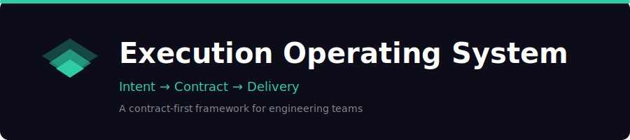

  

  
  
  

---

## Why: avoidable churn

We have concrete misses where interface/contract intent was ambiguous (COE tool, simplified interface). Not pervasive, but avoidable.

> **Result** &mdash; plausible builds that were not the customer outcome
>
> **Goal** &mdash; make intent testable earlier so rework is avoidable

---

## Minimal operating model (contract-first)

> Contract-first = UX flow + API contract reviewed together; UI must not force incoherent APIs.

  

---

## This cycle (D150): lock what is in motion

<table>
<tr>
<td width="40">

</td>
<td>

**Definition of Done** in Linear + milestones + short tech design note

</td>
</tr>
<tr>
<td>

</td>
<td>

**No new process rollout mid-cycle**

</td>
</tr>
<tr>
<td>

</td>
<td>

If sign-off is blocked past date X, **DRI escalates to Daniel or Matt**; decision + rationale recorded in Linear

</td>
</tr>
</table>

---

## D180 automation target: Linear gatekeeping

<table>
<tr>
<td width="40">

</td>
<td>

Block **'In Progress'** unless DoD fields + mock/contract link are present for interface/contract work

</td>
</tr>
<tr>
<td>

</td>
<td>

Bot can **auto-stub the design note** to reduce friction

</td>
</tr>
<tr>
<td>

</td>
<td>

Enforces intent before build &mdash; **automation beats process**

</td>
</tr>
</table>

---

## UAT expansion (highest ROI)

| | |
|---|---|
| **Focus areas** | authnz, installers, model engine |
| **Approach** | Build on existing CD pipeline + SDK smoke tests; expand with Playwright browser flows + regression harness |
| **Outcome** | Fewer regressions without slowing delivery |

---

## Example chain: make intent testable

  

  <em>If mock/contract is missing, we build plausible outcomes that are not the customer outcome.</em>

---

## Repo contents

| | Resource | Description |
|:--|:---------|:------------|
| **[`templates/`](templates/)** | Fill-in-the-blank artifacts | [PRD-lite](templates/prd-lite.md) · [UX mock](templates/ux-mock.md) · [Design note](templates/design-note.md) |
| **[`case-studies/`](case-studies/)** | Process in action | [WorkRoom Implementation](case-studies/workroom-implementation.md) |
| **[`automation/`](automation/)** | D180 build specs | [Linear gatekeeping](automation/linear-gatekeeping.md) |
| **[`decisions/`](decisions/)** | Decision log | [Execution operating system decisions](decisions/001-execution-operating-system.md) |

---

<strong>Appendix: templates (tiny + specific)</strong>

 

| Artifact | Contents | Template |
|:---------|:---------|:---------|
| **PRD-lite** | problem, user, workflow, success criteria, non-goals, risks | [Use template &rarr;](templates/prd-lite.md) |
| **UX mock** | one screen + user journey description | [Use template &rarr;](templates/ux-mock.md) |
| **Design note** | approach, API/interface impacts, data model impacts, security implications, rollout plan | [Use template &rarr;](templates/design-note.md) |

**What good looks like:**
- Data model impact = entities + migration story
- Security = authz touchpoints + audit fields

<strong>Appendix: learning loop</strong>

 

- **Hot wash:** same-day capture of surprises and pain points
- **Retro/COE:** metrics-based root cause by layer
- **Output:** 3-5 corrective actions with DRIs and dates

<strong>Appendix: ownership model</strong>

 

| Role | Responsibility |
|:-----|:---------------|
| **Customer surrogate** | Owns intent (Probst, Preston, field engineers) |
| **Project lead** | Owns the PRD artifact |
| **Engineering** | Negotiates feasibility and nonfunctional requirements |

Explicit decision + escalation + log.

---

  krti@kamiwaza.ai · Feb 2026

